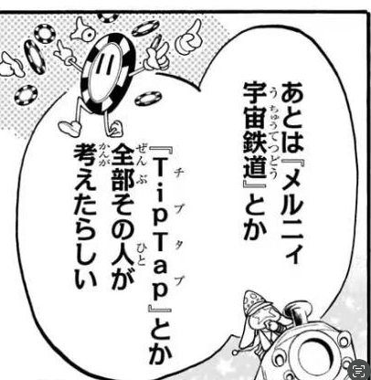
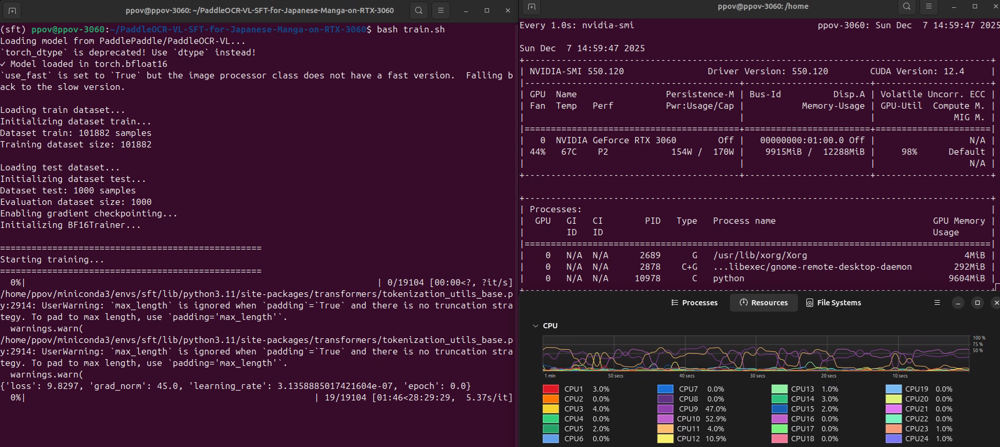
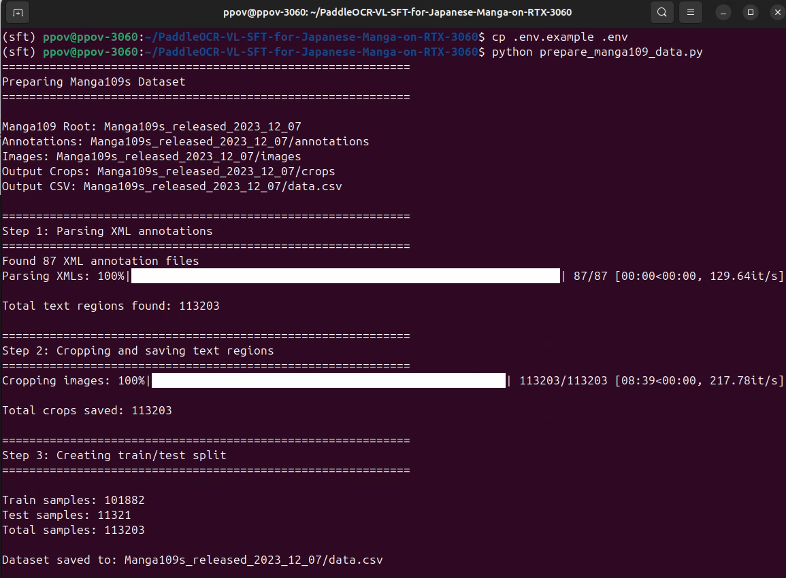

# PaddleOCR-VL Fine-tuning for Japanese Manga OCR

[English](#english) | [中文](#中文)

| Image | Prediction | Training on RTX-3060
|---|---|---|
|  | あとは『メルニィ<br>宇宙鉄道』とか<br>『TipTap』とか<br>全部その人が<br>考えたらしい | |

---

<a name="english"></a>
## English

Fine-tune [PaddleOCR-VL](https://huggingface.co/PaddlePaddle/PaddleOCR-VL) on the [Manga109s](http://www.manga109.org/en/index.html) dataset for Japanese manga text recognition using an **RTX 3060 (12 GB)**, based on the [PaddleOCR-VL-For-Manga](https://huggingface.co/jzhang533/PaddleOCR-VL-For-Manga) project.

### 🎯 Results

After fine-tuning on RTX 3060 (12GB VRAM):

| Metric | Base Model | **Fine-tuned** | Change |
|--------|------------|----------------|--------|
| **Exact Match** | 9.0% | **64.4%** | +55.4% ⬆️ |
| **CER** | 55.41% | **10.88%** | 80% reduction ⬇️ |

The base model struggles with vertical Japanese text reading order in manga. After fine-tuning, the model correctly handles manga-specific text layouts.

### 📋 Requirements

- **GPU**: NVIDIA RTX 3060 or better (12GB+ VRAM)
- **Python**: 3.9+
- **CUDA**: 11.8+
- **Dataset**: [Manga109s](http://www.manga109.org/en/index.html) (request academic access)

### 🚀 Quick Start

#### 1. Clone and Setup

```bash
git clone https://github.com/openvino-book/PaddleOCR-VL-SFT-for-Japanese-Manga-on-RTX-3060.git
cd PaddleOCR-VL-SFT-for-Japanese-Manga-on-RTX-3060

# Create conda environment
conda create -n manga-ocr python=3.11 -y
conda activate manga-ocr

# Install dependencies
pip install torch torchvision --index-url https://download.pytorch.org/whl/cu118
pip install -r requirements.txt
```

#### 2. Prepare Dataset

Download and prepare Manga109s dataset:

```bash
# Step 1: Download from HuggingFace (requires agreement to terms)
# Visit: https://huggingface.co/datasets/hal-utokyo/Manga109-s
# Download: Manga109s_released_2023_12_07.zip

# Step 2: Extract to project directory
unzip Manga109s_released_2023_12_07.zip -d .

# Configure environment
cp .env.example .env
# Edit .env to set MANGA109_ROOT path

# Prepare training data (crop text regions)
python prepare_manga109_data.py
```

<p align="center">
  
</p>


#### 3. Train

```bash
bash train.sh
```
<p align="center">
  
</p>

Training takes approximately **27 hours** on RTX 3060.

#### 4. Evaluate

```bash
# Evaluate fine-tuned model
python evaluate_model.py --model_path ./sft_output --num_samples 500

# Compare with base model
python evaluate_model.py --model_path PaddlePaddle/PaddleOCR-VL --num_samples 500
```

### 📁 Project Structure

```
├── sft_paddleocr_vl.py    # Main training script
├── ocr_dataset.py         # Dataset loader
├── custom_collator.py     # Data collator for VL models
├── prepare_manga109_data.py  # Data preparation
├── evaluate_model.py      # Evaluation script
├── train.sh               # Training launcher
├── .env.example           # Environment config template
└── pyproject.toml         # Project config
```

### ⚙️ Training Configuration

| Parameter | Value | Description |
|-----------|-------|-------------|
| Epochs | 3 | Training epochs |
| Batch Size | 1 | Per-device batch size |
| Gradient Accumulation | 16 | Effective batch size = 16 |
| Learning Rate | 2e-5 | With cosine scheduler |
| Precision | BF16 | Mixed precision training |
| Max Length | 1536 | Sequence length limit |

### 🔧 Customization

**Resume from checkpoint:**
```bash
python sft_paddleocr_vl.py \
    --resume_from_checkpoint ./sft_output/checkpoint-2000 \
    ... # other args
```

**Adjust training parameters:**
Edit `train.sh` to modify epochs, learning rate, batch size, etc.

### 📊 Technical Notes

- **BF16 Precision**: Uses custom `BF16Trainer` with `torch.amp.autocast` for stable mixed precision training
- **Gradient Checkpointing**: Enabled to fit model in 12GB VRAM
- **No Flash Attention**: Disabled for RTX 3060 compatibility

---

<a name="中文"></a>
## 中文

将 [PaddleOCR-VL](https://huggingface.co/PaddlePaddle/PaddleOCR-VL) 基于 [Manga109s](http://www.manga109.org/en/index.html) 数据集进行微调，用于日语漫画文本识别，并使用 **RTX 3060（12GB）** 进行训练，项目参考自 [PaddleOCR-VL-For-Manga](https://huggingface.co/jzhang533/PaddleOCR-VL-For-Manga)。


### 🎯 训练效果

在 RTX 3060 (12GB 显存) 上微调后的效果：

| 指标 | 原始模型 | **微调后** | 变化 |
|------|----------|------------|------|
| **完全匹配率** | 9.0% | **64.4%** | +55.4% ⬆️ |
| **字符错误率 (CER)** | 55.41% | **10.88%** | 降低 80% ⬇️ |

原始模型无法正确处理漫画中的竖排日文阅读顺序。微调后，模型能够正确识别漫画特有的文字排版。

### 📋 环境要求

- **显卡**: NVIDIA RTX 3060 或更好 (12GB+ 显存)
- **Python**: 3.9+
- **CUDA**: 11.8+
- **数据集**: [Manga109s](http://www.manga109.org/en/index.html) (需申请学术使用权限)

### 🚀 快速开始

#### 1. 克隆并配置环境

```bash
git clone https://github.com/openvino-book/PaddleOCR-VL-SFT-for-Japanese-Manga-on-RTX-3060.git
cd PaddleOCR-VL-SFT-for-Japanese-Manga-on-RTX-3060

# 创建 conda 环境
conda create -n manga-ocr python=3.11 -y
conda activate manga-ocr

# 安装依赖
pip install torch torchvision --index-url https://download.pytorch.org/whl/cu118
pip install -r requirements.txt
```

#### 2. 准备数据集

下载并准备 Manga109s 数据集：

```bash
# 第一步：从 HuggingFace 下载（需同意使用条款）
# 访问：https://huggingface.co/datasets/hal-utokyo/Manga109-s
# 下载：Manga109s_released_2023_12_07.zip

# 第二步：解压到项目目录
unzip Manga109s_released_2023_12_07.zip -d .

# 配置环境变量
cp .env.example .env
# 编辑 .env 设置 MANGA109_ROOT 路径

# 准备训练数据（裁剪文字区域）
python prepare_manga109_data.py
```

#### 3. 开始训练

```bash
bash train.sh
```

在 RTX 3060 上训练大约需要 **27 小时**。

#### 4. 评估模型

```bash
# 评估微调后的模型
python evaluate_model.py --model_path ./sft_output --num_samples 500

# 与原始模型对比
python evaluate_model.py --model_path PaddlePaddle/PaddleOCR-VL --num_samples 500
```

### 📁 项目结构

```
├── sft_paddleocr_vl.py    # 主训练脚本
├── ocr_dataset.py         # 数据集加载器
├── custom_collator.py     # VL 模型数据整理器
├── prepare_manga109_data.py  # 数据准备脚本
├── evaluate_model.py      # 评估脚本
├── train.sh               # 训练启动脚本
├── .env.example           # 环境配置模板
└── pyproject.toml         # 项目配置
```

### ⚙️ 训练配置

| 参数 | 值 | 说明 |
|------|-----|------|
| 训练轮数 | 3 | epochs |
| 批次大小 | 1 | 单卡 batch size |
| 梯度累积 | 16 | 有效 batch size = 16 |
| 学习率 | 2e-5 | 使用余弦调度器 |
| 精度 | BF16 | 混合精度训练 |
| 最大长度 | 1536 | 序列长度限制 |

### 🔧 自定义配置

**从检查点恢复训练：**
```bash
python sft_paddleocr_vl.py \
    --resume_from_checkpoint ./sft_output/checkpoint-2000 \
    ... # 其他参数
```

**调整训练参数：**
编辑 `train.sh` 修改训练轮数、学习率、批次大小等。

### 📊 技术说明

- **BF16 精度**: 使用自定义 `BF16Trainer` 配合 `torch.amp.autocast` 实现稳定的混合精度训练
- **梯度检查点**: 启用以适应 12GB 显存
- **无 Flash Attention**: 为兼容 RTX 3060 而禁用

---

## Acknowledgements / 致谢

This project is based on and inspired by:

- [PaddleOCR-VL-For-Manga](https://github.com/jzhang533/PaddleOCR-VL-For-Manga) by jzhang533 - Original fine-tuning implementation
- [Manga109](http://www.manga109.org/en/index.html) - Japanese manga dataset for academic research
- [PaddleOCR-VL](https://huggingface.co/PaddlePaddle/PaddleOCR-VL) - Base vision-language OCR model

本项目基于以下项目：

- [PaddleOCR-VL-For-Manga](https://github.com/jzhang533/PaddleOCR-VL-For-Manga) by jzhang533 - 原始微调实现
- [Manga109](http://www.manga109.org/en/index.html) - 学术研究用日本漫画数据集
- [PaddleOCR-VL](https://huggingface.co/PaddlePaddle/PaddleOCR-VL) - 基础视觉语言 OCR 模型

---

## License

This project is for academic research purposes. Please follow the license terms of:
- [PaddleOCR-VL](https://huggingface.co/PaddlePaddle/PaddleOCR-VL)
- [Manga109s](http://www.manga109.org/en/index.html)
